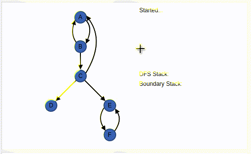

# gui implementation for gabow algorithm 

[penjelasan algoritma](https://pdfs.semanticscholar.org/6020/e1f2d770525d48067158687b5fcbf1a73a2c.pdf)

[java 
source](https://algs4.cs.princeton.edu/42digraph/GabowSCC.java.html)
[digraph java source](https://algs4.cs.princeton.edu/42digraph/)

## all assert and unit test in java file is not implemented in matlab

why do people still code in matlab? 
